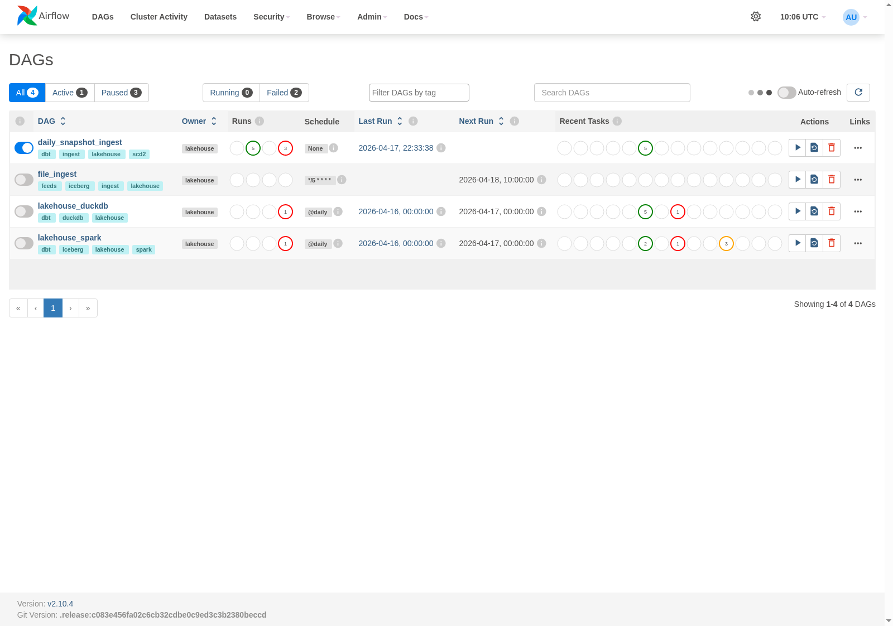
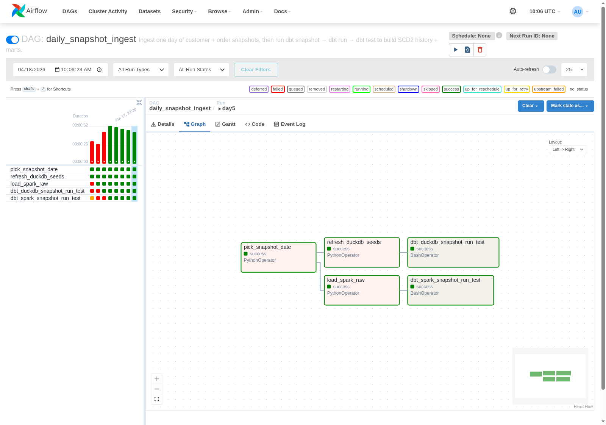
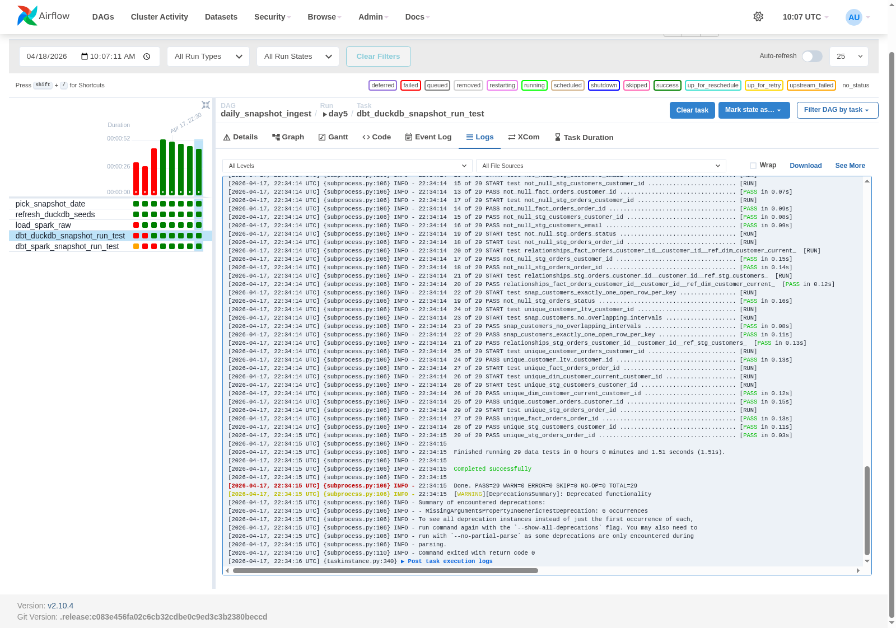
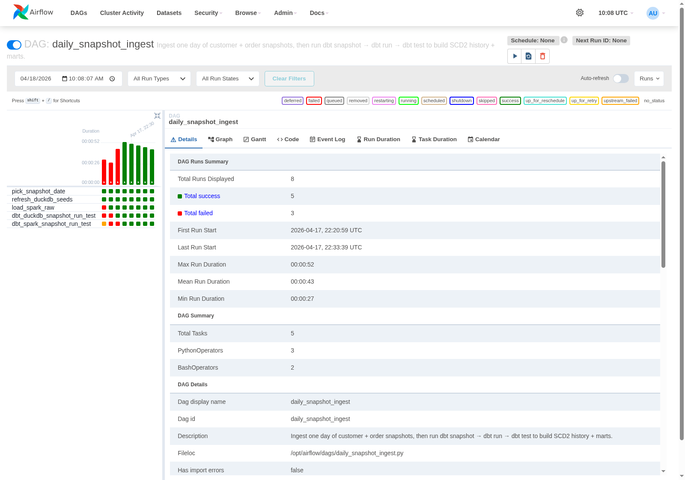
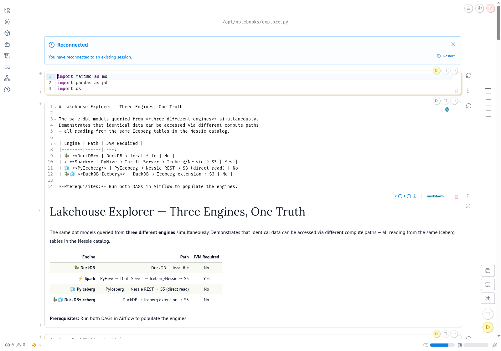

# SCD2 Demo Walkthrough

This page captures a visual, end-to-end walkthrough of the Slowly Changing
Dimensions Type 2 (SCD2) pipeline introduced in
[PR #3](https://github.com/RichardFellows/lakehouse-local/pull/3). It shows
the daily snapshot ingest DAG running in Airflow, the dbt tests passing, and
the five historical scenarios captured by the SCD2 snapshots.

## What SCD2 demonstrates here

Every morning a batch job delivers two full-table CSV snapshots to the feeds
directory:

```
feeds/daily_snapshots/2024-07-11/customers.csv
feeds/daily_snapshots/2024-07-11/orders.csv
feeds/daily_snapshots/2024-07-12/customers.csv
...
feeds/daily_snapshots/2024-07-15/customers.csv
```

The `daily_snapshot_ingest` Airflow DAG picks one day per run, refreshes the
raw landing tables in both DuckDB (seed reload) and Spark/Iceberg
(`INSERT OVERWRITE` via a staging path), then runs `dbt snapshot` → `dbt run`
→ `dbt test`. The dbt snapshot uses the `timestamp` strategy on `updated_at`,
so a new version of a row is only captured when the row actually changes.

The 5 days of feeds cover every interesting SCD2 scenario:

| Day | Scenario | Row affected |
|---|---|---|
| 2024-07-11 | Baseline | All 5 customers + 5 orders inserted |
| 2024-07-12 | Attribute update | Bob's `email` changes from `bob@example.com` to `bob.jones@newmail.io` |
| 2024-07-13 | Insert | Frank (customer_id=6) added; Bob's email regresses (snapshot correctly records no change) |
| 2024-07-14 | Multiple changes | Charlie's `last_name` changes Brown → Green; order 1004 moves from `pending` → `completed` |
| 2024-07-15 | No-op | Feed identical to day 4; snapshot must not create new versions |

## Airflow UI — `daily_snapshot_ingest`

### DAG list

All four DAGs parse successfully from a Postgres-backed Airflow. `daily_snapshot_ingest` is unpaused and has 5 successful runs / 3 failed runs (the failures are earlier iterations during PR #3 development; the last 5 runs are all green).



### Graph view (day 5 run)

The DAG fans out from `pick_snapshot_date` to two parallel raw-load paths
(`refresh_duckdb_seeds` and `load_spark_raw`) then converges into two
per-engine dbt stages
(`dbt_duckdb_snapshot_run_test` and `dbt_spark_snapshot_run_test`). All tasks
green on day 5.



### dbt test output (day 5 — DuckDB)

The task log for `dbt_duckdb_snapshot_run_test` ends with:

```
Finished running 29 data tests in 0 hours 0 minutes and 1.51 seconds (1.51s).
…
Done. PASS=29 WARN=0 ERROR=0 SKIP=0 TOTAL=29
```

29 tests include the SCD2 invariants (`snap_customers_exactly_one_open_row_per_key`, `snap_customers_no_overlapping_intervals`, `fact_orders_asof_join_resolves`) plus the standard dbt relationships/not-null/unique tests on staging + mart models. The Spark target runs an equivalent test suite (36/36 pass; it includes extra Iceberg-specific checks).



### Run history

The mini-grid on the left of the details page shows the per-day history across
all 5 tasks — the 5 successful runs (2024-07-11 … 2024-07-15) appear as the
five rightmost green columns. Total runs: 8, total success: 5, total failed: 3
(the 3 failures are early DAG iterations before the `file_format: iceberg`
snapshot fix).



## Marimo notebook — `explore.py`

The multi-engine Marimo notebook is bind-mounted into the `notebook`
container and reads the same Iceberg catalog + DuckDB file the DAGs
produce. When opened it shows the 4 engines side by side (DuckDB, Spark
Thrift, PyIceberg direct, and DuckDB with the Iceberg extension).



Four-engine parity was verified during
[PR #2](https://github.com/RichardFellows/lakehouse-local/pull/2) and
[PR #3](https://github.com/RichardFellows/lakehouse-local/pull/3) (Diana @
£740 top customer across DuckDB, Spark Thrift, and PyIceberg reads of the
`customer_orders` mart).

## SCD2 narrative — query outputs

The queries below were captured from the live DuckDB warehouse after the
5-day replay. They demonstrate the three core SCD2 behaviours:
attribute-level change capture, insertion with no retroactive effect on
earlier rows, and as-of join correctness in the fact table.

### S1. Bob's email history — attribute update captured

```sql
SELECT customer_id, email, dbt_valid_from, dbt_valid_to
FROM snapshots.snap_customers
WHERE customer_id = 2
ORDER BY dbt_valid_from;
```

```
customer_id  email                 dbt_valid_from       dbt_valid_to
-----------  --------------------  -------------------  -------------------
2            bob@example.com       2024-07-11 00:00:00  2024-07-12 08:23:11
2            bob.jones@newmail.io  2024-07-12 08:23:11  NULL
```

Exactly 2 rows for Bob, with non-overlapping validity intervals. The open row
(`dbt_valid_to IS NULL`) is the current version.

### S2. Charlie's last_name history — separate attribute change on day 4

```sql
SELECT customer_id, last_name, dbt_valid_from, dbt_valid_to
FROM snapshots.snap_customers
WHERE customer_id = 3
ORDER BY dbt_valid_from;
```

```
customer_id  last_name  dbt_valid_from       dbt_valid_to
-----------  ---------  -------------------  -------------------
3            Brown      2024-07-11 00:00:00  2024-07-14 11:00:00
3            Green      2024-07-14 11:00:00  NULL
```

Charlie's last_name changes on day 4, not day 2 like Bob's email — proving
the snapshot is reading `updated_at` per-row, not collapsing all changes to
a single run timestamp.

### S3. Frank inserted on day 3

```sql
SELECT customer_id, first_name, last_name, dbt_valid_from, dbt_valid_to
FROM snapshots.snap_customers
WHERE customer_id = 6;
```

```
customer_id  first_name  last_name  dbt_valid_from       dbt_valid_to
-----------  ----------  ---------  -------------------  ------------
6            Frank       Miller     2024-07-13 09:00:00  NULL
```

Frank only appears from day 3 onwards (`dbt_valid_from = 2024-07-13
09:00:00`, the `updated_at` timestamp carried on the feed row). A
relationships test on `fact_orders.customer_id → snap_customers` would
fail if Frank's order retroactively appeared on day 1 or 2.

### S4. Order 1004 status transition on day 4

```sql
SELECT order_id, status, dbt_valid_from, dbt_valid_to
FROM snapshots.snap_orders
WHERE order_id = 1004
ORDER BY dbt_valid_from;
```

```
order_id  status     dbt_valid_from       dbt_valid_to
--------  ---------  -------------------  -------------------
1004      pending    2024-06-10 09:15:00  2024-07-14 08:30:00
1004      completed  2024-07-14 08:30:00  NULL
```

The `pending` row is valid from the original order date (2024-06-10) all
the way to 2024-07-14 08:30, then the `completed` row takes over. `dbt
snapshot` preserves the original `updated_at` as `dbt_valid_from` for the
first row — a common-case detail that is easy to get wrong in hand-rolled
SCD2.

### S5. `fact_orders` as-of join resolves to the correct customer version

```sql
SELECT order_id, customer_id, order_date,
       customer_email_asof, customer_first_name_asof, customer_last_name_asof
FROM main.fact_orders
WHERE customer_id = 2
ORDER BY order_date;
```

```
order_id  customer_id  order_date  customer_email_asof  customer_first_name_asof  customer_last_name_asof
--------  -----------  ----------  -------------------  ------------------------  -----------------------
1002      2            2024-06-02  bob@example.com      Bob                       Jones
1006      2            2024-06-20  bob@example.com      Bob                       Jones
```

Both of Bob's orders are dated *before* his email change (2024-07-12
08:23:11), so the as-of join resolves both to his historical email
(`bob@example.com`), not his current one. This is the single most
important SCD2 correctness check: a naive join to `dim_customer_current`
would incorrectly stamp every historical order with Bob's current email.
The custom `fact_orders_asof_join_resolves` test enforces this invariant
for every row in `fact_orders`.

### S6. `customer_orders` mart — stable column contract

```sql
SELECT customer_id, first_name, total_orders, total_revenue, customer_tier
FROM main.customer_orders
ORDER BY total_revenue DESC;
```

```
customer_id  first_name  total_orders  total_revenue  customer_tier
-----------  ----------  ------------  -------------  -------------
4            Diana       2             740.00         medium
1            Alice       3             455.50         high
5            Eve         1             199.99         low
2            Bob         2             89.99          medium
6            Frank       1             85.00          low
3            Charlie     2             45.00          medium
```

The existing `customer_orders` mart was preserved with the same column
contract even though it now reads from `fact_orders` (SCD2-aware)
instead of the raw staging tables, so the 4-engine notebook continues to
pass. Frank (customer 6) appears because he was inserted on day 3 and
his one order landed on day 4.

## Reproducing this walkthrough

1. Bring up the stack: `docker compose --profile both up -d`
2. Wait for Airflow to be healthy (Postgres-backed; ~30s): `http://localhost:8082` (see README for admin password location).
3. Trigger the DAG for each of the 5 days, in order:

   ```bash
   for d in 2024-07-11 2024-07-12 2024-07-13 2024-07-14 2024-07-15; do
     docker exec lakehouse-local-airflow-1 \
       airflow dags trigger daily_snapshot_ingest \
       --conf "{\"snapshot_date\":\"$d\"}" \
       --run-id "day-${d}"
     # wait for success before the next trigger — the snapshot_date is the
     # only thing that changes between runs so they must be serialised
     until docker exec lakehouse-local-airflow-1 airflow dags state \
       daily_snapshot_ingest "day-${d}" 2>/dev/null | grep -q success; do
       sleep 5
     done
   done
   ```

4. Open `http://localhost:2718`, run `explore.py`, and verify the 4-engine
   Connection Status cell + `customer_orders` mart cell.
5. For the SCD2 narrative queries, run against DuckDB directly:

   ```bash
   docker exec -it lakehouse-local-airflow-1 \
     python3 -c "import duckdb; duckdb.connect('/opt/dbt/lakehouse.duckdb', read_only=True).sql('SELECT customer_id, email, dbt_valid_from, dbt_valid_to FROM snapshots.snap_customers WHERE customer_id=2 ORDER BY dbt_valid_from').show()"
   ```

## Related PRs

- [PR #2](https://github.com/RichardFellows/lakehouse-local/pull/2) — Iceberg/Nessie/S3 classpath fixes that make `file_ingest` + Nessie branching work end-to-end
- [PR #3](https://github.com/RichardFellows/lakehouse-local/pull/3) — introduction of the SCD2 snapshots, Postgres backing store, and daily ingest DAG documented here
